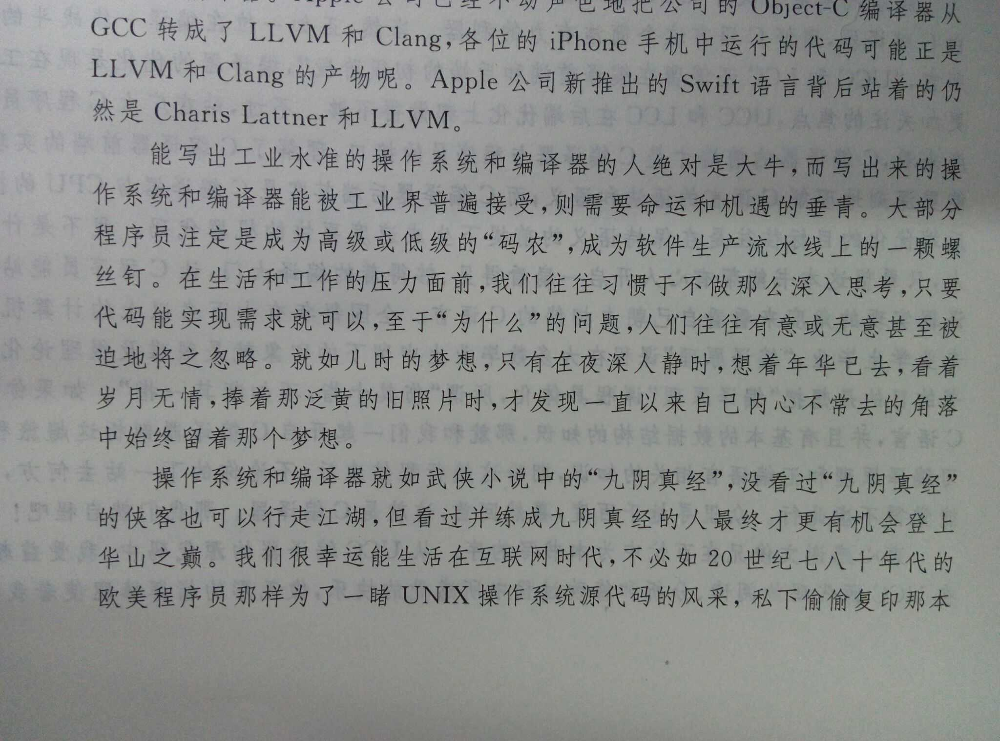

# How To Network

To become a software engineer instead of a developer, you should know ...

## Before Reading

My nativae language is not english, and I plan to use english in this repo. But for now, I can't write english article fluently. I plan to improve my english to comunicate with World better :smile:.

## Overviews

- Topics, contain specific topic more detail.

[Browser Same-Origin Policy](./topic/from_same_origin_policy.md)

- Implementations, Codes writen by Golang/C/Python.

Nope

- Tutorials, more systematic contents.

1. [king way of computer network guide](./tutorial/king_way/README.md)

