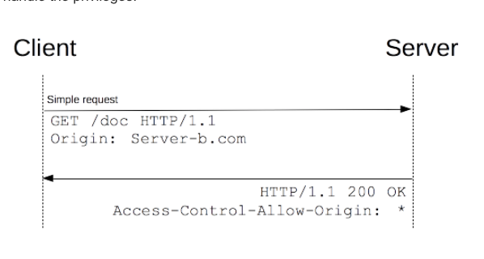
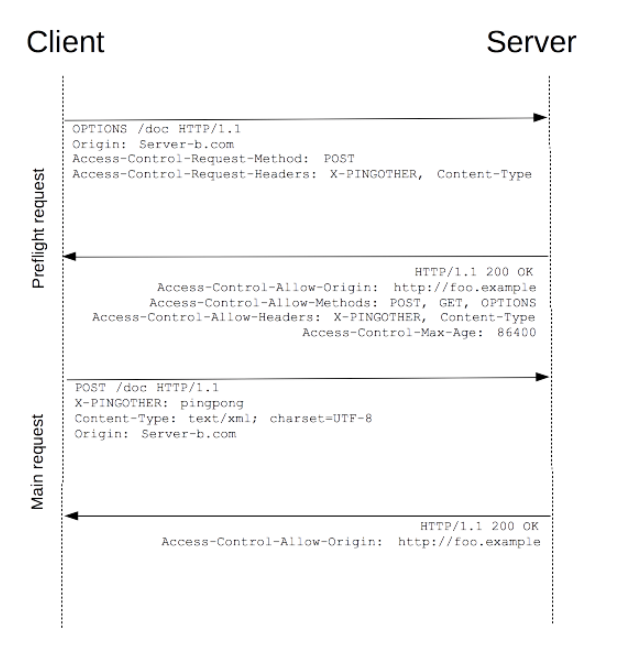

# 浏览器同源策略而起

KeyWord:

- [same-origin policy](https://developer.mozilla.org/en-US/docs/Web/Security/Same-origin_policy)
- [Cross-Origin-Resource-Sharing, CORS](https://developer.mozilla.org/en-US/docs/Web/HTTP/CORS)
- [XMLHttpRequest](https://developer.mozilla.org/en-US/docs/Web/API/XMLHttpRequest)
- [Asynchrounous JavaScript And XML, AJAX](https://developer.mozilla.org/en-US/docs/Web/Guide/AJAX/Getting_Started)
- [Cross-Site Request Forgery, CSRF](https://www.owasp.org/index.php/Cross-Site_Request_Forgery_%28CSRF%29)

Reference

[Link 1](https://juejin.im/post/5ba1d4fe6fb9a05ce873d4ad)

[Link 2](http://www.ruanyifeng.com/blog/2016/04/same-origin-policy.html)

上两篇总结的很清楚, 易懂了, 我只是额外总结汇总一下. 以几个问题的形式展开.

1. 同源策略的含义

protocol + host + port 一致为同源

2. 为什么有同源策略

安全, 但因何而起不安全(没有同源策略的话?), 2个维度上说明: 

- DOM, 网页可以内嵌别的页面(frame/iframe 标签), 如果没有同源策略, 任意网页都可读内嵌页面的DOM元素内容...(比如登录账号/密码)
- XMLRequest, 跨域的请求, 携带cookie(如果没有同源策略的话), 身份伪造?

3. 那正常的跨域资源分享怎么进行?

CORS 登场!

Cross-Origin Resource Sharing (CORS) is a mechanism that uses additional HTTP headers to tell a browser to let a web application running at one origin (domain) have permission to access selected resources from a server at a different origin.

对请求分2类

- Simple Requests

Don't trigger a CORS preflight(options). 1. GET, HEAD, POST. 2. 受限的头, 如Accept-Language, Content-Type... 3. 受限的Content-Type, 只接受 application/x-www-form-urlencoded, mulitpart/form-data, text/plain. 4. No event listeners are registered on any XMLHttpRequestUpload object used in the request. 5. No ReadableStream object is used in the request.

> These are the same kinds of cross-site requests that web content can already issue, and no response data is released to the requester unless the server sends an appropriate header. Therefore, sites that prevent cross-site request forgery have nothing new to fear from HTTP access control.

- Preflight Requests

Unlike “simple requests” (discussed above), "preflighted" requests first send an HTTP request by the OPTIONS method to the resource on the other domain, in order to determine whether the actual request is safe to send. Cross-site requests are preflighted like this since they may have implications to user data.

Requests with Crendentials:

js + Access-Control-Allow-Credentials: true + Access-Control-Allow-Origin is NOT *
